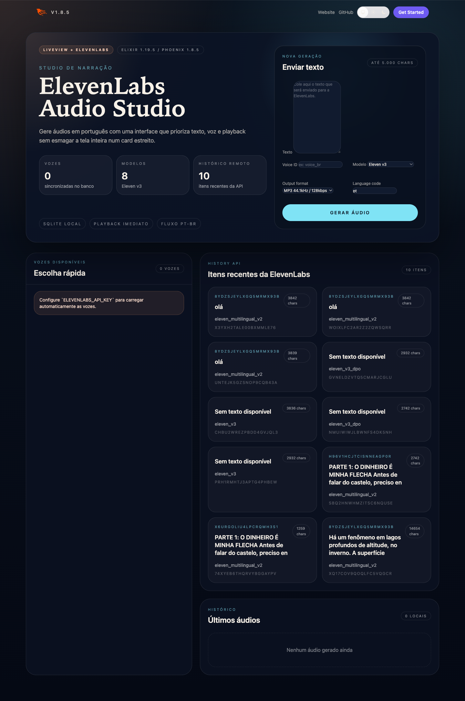

# PhoenixTts

Aplicação Phoenix + LiveView para gerar áudios na ElevenLabs, sincronizar vozes no banco e armazenar os arquivos MP3 junto com os metadados da geração.



## O que faz

- gera áudio com `POST /v1/text-to-speech/:voice_id`;
- sincroniza vozes via `GET /v1/voices` e persiste em `audio_voices`;
- consulta modelos via `GET /v1/models`;
- mostra histórico remoto com `GET /v1/history`;
- mantém histórico local das gerações com player e download direto.

## Stack

- Elixir `1.19.5`
- Phoenix `1.8.5`
- LiveView `1.1.x`
- Tailwind CSS `4.x`
- SQLite via `ecto_sqlite3` em desenvolvimento/teste
- PostgreSQL via `postgrex` em produção

## Setup

```bash
cd phoenix_tts
mix setup
```

Configure as variáveis de ambiente antes de subir o servidor:

```bash
cp .env.example .env
```

Depois edite `.env` e preencha pelo menos:

```bash
ELEVENLABS_API_KEY=...
```

Opcionalmente:

```bash
ELEVENLABS_BASE_URL=https://api.elevenlabs.io
ELEVENLABS_DEFAULT_OUTPUT_FORMAT=mp3_44100_128
AUDIO_STORAGE_DIR=priv/static/generated
```

## Rodando

Crie o banco local:

```bash
mix ecto.create
mix ecto.migrate
```

Suba a aplicação:

```bash
mix phx.server
```

Abra [http://localhost:4000](http://localhost:4000).

## Estrutura principal

- `lib/phoenix_tts/audio.ex`: contexto de domínio para geração e persistência
- `lib/phoenix_tts/audio/voice.ex`: schema das vozes sincronizadas no banco
- `lib/phoenix_tts/eleven_labs/client.ex`: cliente HTTP da ElevenLabs com `Req`
- `lib/phoenix_tts_web/live/audio_live.ex`: interface LiveView
- `priv/repo/migrations/20260325224000_create_audio_generations.exs`: tabela base do histórico
- `priv/repo/migrations/20260325230500_add_elevenlabs_metadata_to_audio_generations.exs`: metadados extras do request/resposta
- `priv/repo/migrations/20260326020124_create_audio_voices.exs`: tabela das vozes sincronizadas

## Fluxo atual

1. Ao abrir a tela, a aplicação busca vozes e faz upsert em `audio_voices`.
2. O formulário abre em modo básico com texto, voz e modelo já selecionados quando o catálogo estiver disponível.
3. A lateral de vozes funciona como seletor rápido e sincroniza a voz escolhida no formulário.
4. O bloco avançado concentra `output_format`, `language_code` e fallback manual de `voice_id` quando necessário.
5. Ao gerar um áudio, os metadados são salvos em `audio_generations` e a última configuração fica preservada para a próxima geração.
6. O histórico local oferece player, download, destaque do item recém-gerado e ação para reaplicar a configuração.

## Testes

O fluxo foi implementado em TDD. Para rodar a suíte:

```bash
mix test
mix precommit
```

## Deploy no Gigalixir

O projeto está preparado para rodar no modelo recomendado de Phoenix Releases do Gigalixir:

- `config/runtime.exs` lê `DATABASE_URL`, `SECRET_KEY_BASE`, `PHX_HOST`, `PORT`, `POOL_SIZE` e `ELEVENLABS_API_KEY`;
- em produção o `Repo` usa PostgreSQL;
- os áudios gerados ficam persistidos no banco, evitando dependência do disco efêmero do app.

Fluxo resumido:

```bash
mix deps.get
mix ecto.migrate
mix test

brew install gigalixir
gigalixir signup
gigalixir login
gigalixir create
gigalixir pg:create --free
gigalixir config:set PHX_HOST=<seu-app>.gigalixirapp.com SECRET_KEY_BASE=$(mix phx.gen.secret) PHX_SERVER=true POOL_SIZE=2 ELEVENLABS_API_KEY=...
git push gigalixir main
gigalixir ps:migrate
```
